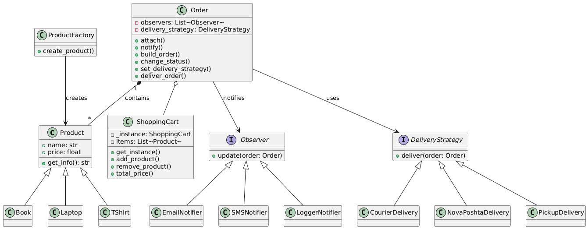

# 🛒 Online Store System

Цей проєкт демонструє застосування шаблонів проєктування на прикладі моделі інтернет-магазину.

---

## 📁 Структура проєкту

```
.
├── main.py
├── cart.py
├── order.py
├── notifier.py
├── strategy.py
├── products/
│   ├── base.py
│   └── factory.py
├── tests/
│   └── test_all.py
└── diagrams/
    └── UML.png

```

---

## 🔧 Шаблони проєктування

| Шаблон        | Опис                                                                 |
|---------------|----------------------------------------------------------------------|
| **Factory**   | Створення продуктів (книги, футболки, ноутбуки)                     |
| **Singleton** | Єдиний екземпляр кошика покупця                                      |
| **Builder**   | Побудова замовлення з продуктів у кошику                            |
| **Observer**  | Сповіщення про зміну статусу замовлення (Email, SMS, Logger)        |
| **Strategy**  | Заміна способу доставки (Кур’єр, Нова Пошта, Самовивіз)             |

---

## 🚀 Запуск

1. Встановіть pytest:
```bash
pip install pytest
```

2. Запустіть тести:
```bash
pytest tests/test_all.py -v
```

---

## 🧪 Охоплення тестами

✅ 20 модульних тестів перевіряють:
- створення продуктів
- поведінку Singleton-класу
- побудову замовлення
- зміну статусу і нотифікації
- стратегії доставки

---

## 📊 UML-діаграма



---

## 👤 Автор

**Остап Дідух**  
Група: Феп-31  
Рік: 2025
